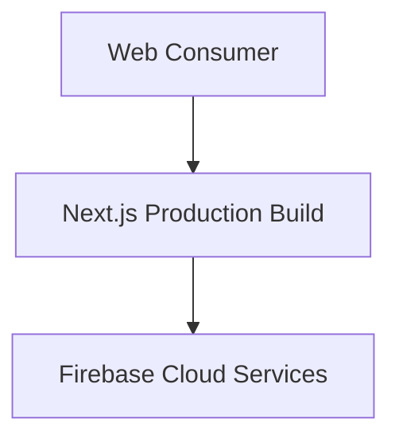
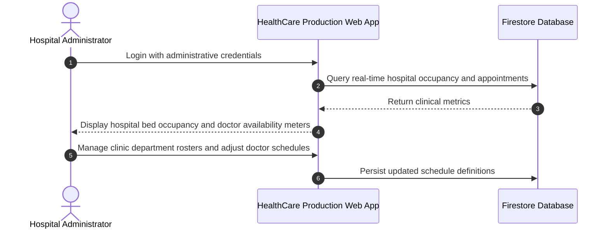

# HealthCare Enterprise Deploy — Production Healthcare Portal
[]()
[]()
[]()
[]()

## Overview
A production-targeted release instance of the PulseCare hospital and clinical management system. Configured for high-reliability hosting with hardened asset delivery, clean environment separation, and full patient-caregiver workflows.

- **Problem Solved:** Production deployment pipeline for medical appointments and hospital management.
- **Target Users:** Hospital administrative staff, physicians, and patients.
- **Current Status:** Production Deployment Release.

## Features
- **Full Clinical Suite:** Triage, Outpatient Booking, Doctor Management, and Admin Telemetry.
- **Cloud-Hardened:** Optimized Next.js build bundle for edge caching and low-latency delivery.
- **Clean Configuration:** Complete environment decoupling for production security.

## Architecture


## User Flow


## Technology Stack
| Layer | Technology | Purpose |
|---|---|---|
| Framework | Next.js 15 | Production React runtime |
| Language | TypeScript | Type safety |
| Styling | Tailwind CSS | Enterprise medical UI |
| Services | Firebase Auth & Firestore | Database and Identity |

## Infrastructure
- **Server Port:** 3000
- **Hosting Target:** Vercel / Firebase Hosting

## Project Structure
```text
health_deploy/
├── src/                 # Application code
├── package.json         # Manifest
├── .env.example         # Template
├── .gitignore           # Git ignore rules
└── README.md            # Technical documentation
```

## Prerequisites
- Node.js >= 18.x
- Firebase Account

## Environment Variables
Create `.env.local`:
```env
NEXT_PUBLIC_FIREBASE_API_KEY=your_firebase_api_key
NEXT_PUBLIC_FIREBASE_PROJECT_ID=your_firebase_project_id
NEXT_PUBLIC_FIREBASE_APP_ID=your_firebase_app_id
NEXT_PUBLIC_FIREBASE_AUTH_DOMAIN=your_project.firebaseapp.com
NEXT_PUBLIC_FIREBASE_MESSAGING_SENDER_ID=your_sender_id
```

## Local Development Setup
```bash
git clone https://github.com/Bhanutejanallamothu/health_deploy.git
cd health_deploy
npm install
npm run dev
```

## Docker Setup
*Not detected in repository.*

## Database Setup
Firestore collections.

## API Documentation
Next.js API routes and server actions.

## Deployment
```bash
npm run build
npm start
```

## Security
- Hardened credentials management.
- Parameterized database requests.

## Testing
```bash
npm run lint
```

## Troubleshooting
- Verify `.env.local` keys match target Firebase project.

## Future Improvements
- Automated database backup scripts.

## License
All rights reserved by repository owner.
